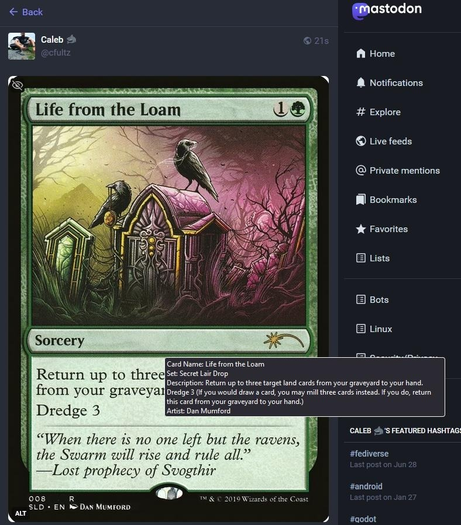

# MTG Random Scryfall Bot 

The is a Mastodon bot that pulls a random Magic: The Gathering card from Scryfall and toots it correctly to a Mastodon instance with full description and hashtags.

## Requirments
- Mastodon.py (pip install Mastodon)

## How to Use
 
- Clone repository
- Create file called ``token.secret`` and place Mastodon Access Token inside
- Change ``api_url_endpoint`` in ``MTGMastodonBot.py`` to your instance URL
- Save and run the bot. eg: ``python MTGMastodonBot.py``

## TODO

- Add ability to have the bot respond to specific card search queries from users and reply
- ???
